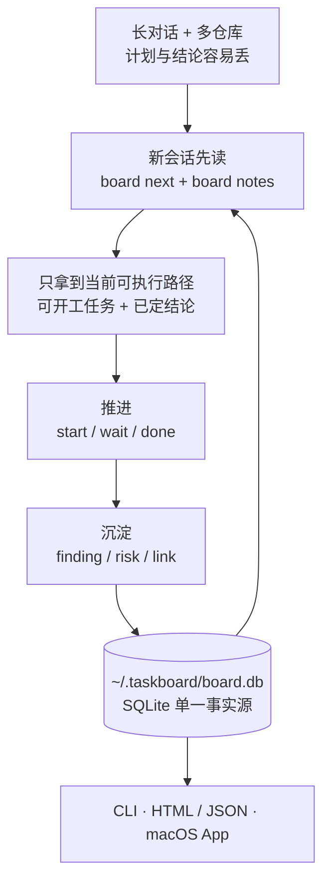

# claude-taskboard

面向个人与 AI 编程助手的跨项目任务看板。CLI 更新进度,本地服务实时查看,或导出
自包含 HTML 发到任何地方。它不是多人协作、权限管理或云同步系统。
纯标准库,无第三方依赖;数据存 `~/.taskboard/board.db`(SQLite)。

解决的问题:和 Claude Code、Codex 等助手长对话时,计划滚出上下文就看不见了;
多个仓库并行推进时,
「现在能开工的是哪几件、谁卡着谁」没有单一去处。

## 30 秒看懂



## 安装

```bash
pip install -e /path/to/claude-taskboard
```

得到全局命令 `board`。数据库位置可用 `TASKBOARD_HOME` 覆盖。

## 让 AI Agent 自动使用

仓库内置标准 Agent Skill: `.agents/skills/taskboard`。先安装上面的 `board` CLI，
再在 claude-taskboard 仓库根目录执行对应命令。

### Codex / Cursor

Codex 和 Cursor 打开本仓库时会自动发现 `.agents/skills`。要让 skill 在所有项目可用：

```bash
TASKBOARD_ROOT="$(pwd)"
mkdir -p "$HOME/.agents/skills"
ln -sfn "$TASKBOARD_ROOT/.agents/skills/taskboard" "$HOME/.agents/skills/taskboard"
```

### Claude Code

```bash
TASKBOARD_ROOT="$(pwd)"
mkdir -p "$HOME/.claude/skills"
ln -sfn "$TASKBOARD_ROOT/.agents/skills/taskboard" "$HOME/.claude/skills/taskboard"
```

### Gemini CLI

Gemini CLI 使用 `GEMINI.md` 上下文文件，而不是 Agent Skills 目录。以下命令会幂等地
导入同一份 `SKILL.md`：

```bash
TASKBOARD_ROOT="$(pwd)"
mkdir -p "$HOME/.gemini"
ln -sfn "$TASKBOARD_ROOT/.agents/skills/taskboard/SKILL.md" "$HOME/.gemini/taskboard.md"
touch "$HOME/.gemini/GEMINI.md"
grep -Fqx '@./taskboard.md' "$HOME/.gemini/GEMINI.md" || \
  printf '\n@./taskboard.md\n' >> "$HOME/.gemini/GEMINI.md"
```

运行 Gemini CLI 后执行 `/memory refresh`。如果 Agent 没有立即发现新建的顶层 skill
目录，重启一次。无法使用符号链接的环境可以复制整个 `taskboard` skill 目录，更新时
重新复制。

安装位置依据 [Codex Skills](https://developers.openai.com/codex/skills)、
[Cursor Agent Skills](https://cursor.com/docs/skills)、
[Claude Code Skills](https://code.claude.com/docs/en/slash-commands) 和
[Gemini CLI GEMINI.md](https://google-gemini.github.io/gemini-cli/docs/cli/gemini-md.html)。

## 上手

```bash
# 登记项目(--repo 登记后,在该目录下执行 board 命令自动定位此项目)
board init website-refresh --name "网站改版" --repo . --summary "重做官网并完成上线"

# 加任务,声明依赖
board add "确认需求" --owner 你
board add "实现页面" --owner 我 --blocked-by 1
board add "发布上线" --gate --blocked-by 2        # --gate 标记闸门/关键节点

# 推进
board start 1
board wait 1                                  # 卡在人工/外部动作上(服务器执行、等发版)
board done 1                                  # 提示解锁了谁、打印验收条件、记录完成时 HEAD

# 看
board brief               # 交接摘要:新会话读这一段就能接上
board next                # 现在能开工的(--owner 我 只看自己的)
board ls                  # 当前项目未完成任务(--done 含已完成,-A 所有项目)
board find <关键词>        # 搜任务与记录
board stale --days 3      # 停滞的在办任务
board projects            # 所有项目的进度概览
board show 3              # 单个任务详情
board log                 # 变更历史
```

`todo`(没开工)、`active`(我在做)、`waiting`(等人工)三态分开:`waiting` 不算
"可开工",因为它等的是人不是我;`board next` 会把它单列成"等人工"。

任务可以带验收条件与代码坐标:

```bash
board add "发布新版" --accept "核心流程冒烟通过" --branch codex/site-refresh --pr 96
```

`--accept` 在 `board done` 时打印出来对照,`board done` 还会把当时的 HEAD sha 记进
事件流(任务字段里存 sha 会被 squash/rebase 弄失效,事件流才是可靠出处)。

## 三类记录,不只是任务

长期项目里真正会被遗忘的不是待办,而是**已经查明的结论**——不写下来就会重复推演。

```bash
board finding "移动端首屏慢在大图" --metric "LCP 4.2s → 1.8s" --body "压缩图片后的对照结果..."
board risk "旧浏览器样式降级" --body "不阻塞上线,后续补兼容验证"
board link "docs/release-checklist.md" --body "发布验收清单"
board notes -v            # 一起看
```

- `finding` 约束性结论:已判定的事实,后续不要再推演
- `risk` 尾巴与已知风险:不阻塞主线但别丢
- `link` 关键文件/入口

### Markdown 内容

任务 `detail`、finding/risk 的 `body` 支持安全 Markdown:段落、标题、无序/有序列表、
引用、粗体/斜体、行内代码、围栏代码块和 HTTP/HTTPS/mailto/相对链接。验收条件与
关键文件说明支持行内格式。标题和 `metric` 保持纯文本结构化字段。

原始 HTML 会被转义，`javascript:`/`data:` 等危险链接不会生成可点击链接。图片、表格、
复杂嵌套列表暂不支持；完整材料应保存在文件中，再用 `board link` 记录入口。

## 查看

```bash
board serve --open        # localhost:8787,CLI 一改 2 秒内自动刷新
board export -p website-refresh --out board.html
board export --json --out board.json   # 给其他工具消费,默认同样隐藏本机路径
board export --show-paths --out local.html  # 仅本地查看时保留数据库和仓库路径
board set --artifact-url https://...   # 记住发布链接,export 时提醒复用
```

导出的 HTML 自包含、无外部请求,可直接作为 Artifact 发布或丢进任何静态托管。
默认隐藏数据库与仓库的本机绝对路径;明暗主题跟随系统,已完成的任务折进一个可展开区块,
页面只显示剩余路径。

发布前仍应检查内容:任务正文、结论、风险、分支名和链接会原样进入导出文件。
用 `-p <key>` 只导出准备公开的项目。`board serve` 没有身份认证,默认只监听
`127.0.0.1`;不要把它直接绑定到公网或不可信局域网。

### macOS 菜单栏 App

原生 AppKit/WebKit 菜单栏 App 复用同一个 SQLite 数据库和 `board export` 渲染逻辑,
不需要常驻 HTTP 服务。窗口打开时监听 `board.db`、WAL 和 SHM 文件,CLI 修改后自动刷新;
关闭终端不会影响 App。

```bash
./macos/TaskboardMenuBar/build_app.sh
mkdir -p ~/Applications
ditto dist/Taskboard.app ~/Applications/Taskboard.app
open ~/Applications/Taskboard.app
```

菜单提供打开/重新加载看板、在 Finder 中显示数据库和“登录时启动”。登录启动使用
macOS 13+ 的 `SMAppService`;首次启用后若系统要求批准,到“系统设置 → 通用 → 登录项”
确认即可。

构建脚本会把当前 `board` 的绝对路径写进 App。换了 Python 环境后重新构建,或启动 App
前设置 `TASKBOARD_BOARD_EXECUTABLE`。数据库默认仍为 `~/.taskboard/board.db`;
也支持 `TASKBOARD_HOME` 或 App 专用的 `TASKBOARD_DB` 绝对路径。

图标母版位于 `macos/TaskboardMenuBar/Resources/AppIcon.png`。构建时
`Scripts/make_icns.sh` 会生成 16px 到 1024px 的标准 `AppIcon.icns` 并装入 App。

## 寻址规则

任务在项目内用 `#ref` 寻址(项目内自增)。当前项目的判定优先级:

1. `-p <key>` 显式指定
2. cwd 落在某项目 `repo` 路径下(最具体的那个胜出)
3. `board use <key>` 固定的项目
4. 只有一个项目时就是它

否则报错要求指定,不会猜。

## 开发

```bash
python3 -m pytest tests -q
swift run --package-path macos/TaskboardMenuBar TaskboardCoreSelfTest
```

数据模型:`projects` / `tasks`(项目内 ref 唯一)/ `deps`(建边时拒绝成环)/
`notes`(finding·risk·link,支持 supersede)/ `events`(只追加的变更流)。
渲染与 `board next` 共用 `Store.snapshot()`,阻塞判定与"可开工"只有这一处实现。

并发:WAL + `busy_timeout`,`ref` 分配在 `BEGIN IMMEDIATE` 写锁下完成,配合
`UNIQUE(project, ref)` 双保险,多个 CLI 进程同时写不会重号。
升级:新版本打开老库会自动补列,不需要单独的迁移命令。
