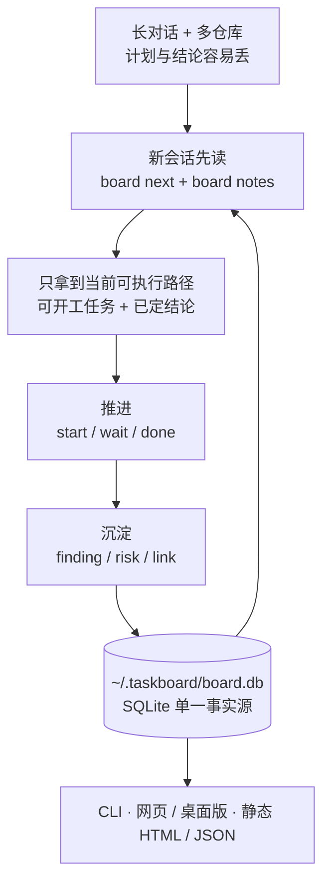

# claude-taskboard

面向个人与 AI 编程助手的跨对话需求/工作流看板。CLI 更新进度,本地服务实时查看,或导出
自包含 HTML 发到任何地方。它不是多人协作、权限管理或云同步系统。
纯标准库,无第三方依赖;数据存 `~/.taskboard/board.db`(SQLite)。

解决的问题:和 Claude Code、Codex 等助手长对话时,计划滚出上下文就看不见了;
一个需求跨多个仓库推进时,
「现在能开工的是哪几件、谁卡着谁」没有单一去处。

## 30 秒看懂



## 安装

### Homebrew（公开仓库发布后）

与 CCSwitch CLI 相同，Taskboard 使用第三方 tap 发布：

```bash
brew tap <github-owner>/tap
brew install taskboard
```

升级与卸载：

```bash
brew upgrade taskboard
brew uninstall taskboard
```

当前仓库尚未关联公开 GitHub remote，因此 `<github-owner>` 仍是发布时参数；本地 Formula、
MIT License、确定性源码归档和 tap 自动更新 workflow 已就绪。Formula 安装 `board` CLI 和
Agent Skill，不会创建或覆盖 `~/.taskboard/board.db`。

### 从源码安装

```bash
pip install -e /path/to/claude-taskboard
```

得到全局命令 `board`。数据库位置可用 `TASKBOARD_HOME` 覆盖。

## 让 AI Agent 自动使用

仓库内置标准 Agent Skill: `.agents/skills/taskboard`。先安装上面的 `board` CLI，
再在 claude-taskboard 仓库根目录执行对应命令。

### Codex / Cursor

Codex 和 Cursor 打开本仓库时会自动发现 `.agents/skills`。要让 skill 在所有项目可用：

```bash
TASKBOARD_ROOT="$(pwd)"
mkdir -p "$HOME/.agents/skills"
ln -sfn "$TASKBOARD_ROOT/.agents/skills/taskboard" "$HOME/.agents/skills/taskboard"
```

### Claude Code

```bash
TASKBOARD_ROOT="$(pwd)"
mkdir -p "$HOME/.claude/skills"
ln -sfn "$TASKBOARD_ROOT/.agents/skills/taskboard" "$HOME/.claude/skills/taskboard"
```

### Gemini CLI

Gemini CLI 使用 `GEMINI.md` 上下文文件，而不是 Agent Skills 目录。以下命令会幂等地
导入同一份 `SKILL.md`：

```bash
TASKBOARD_ROOT="$(pwd)"
mkdir -p "$HOME/.gemini"
ln -sfn "$TASKBOARD_ROOT/.agents/skills/taskboard/SKILL.md" "$HOME/.gemini/taskboard.md"
touch "$HOME/.gemini/GEMINI.md"
grep -Fqx '@./taskboard.md' "$HOME/.gemini/GEMINI.md" || \
  printf '\n@./taskboard.md\n' >> "$HOME/.gemini/GEMINI.md"
```

运行 Gemini CLI 后执行 `/memory refresh`。如果 Agent 没有立即发现新建的顶层 skill
目录，重启一次。无法使用符号链接的环境可以复制整个 `taskboard` skill 目录，更新时
重新复制。

安装位置依据 [Codex Skills](https://developers.openai.com/codex/skills)、
[Cursor Agent Skills](https://cursor.com/docs/skills)、
[Claude Code Skills](https://code.claude.com/docs/en/slash-commands) 和
[Gemini CLI GEMINI.md](https://google-gemini.github.io/gemini-cli/docs/cli/gemini-md.html)。

## 上手

```bash
# 先确认稳定目标和涉及仓库，再登记一级需求；--repo 可重复
board init website-refresh --name "网站改版" --summary "重做官网并完成上线" \
  --repo ../website_backend --repo ../website_frontend

# 加执行任务,明确本任务涉及需求仓库中的哪几个
board add "确认需求" --owner 你 --priority P1 --repo website_backend --repo website_frontend
board add "实现页面" --owner 我 --priority P1 --blocked-by 1 --repo website_frontend
board add "发布上线" --gate --priority P0 --blocked-by 2 --repo website_backend --repo website_frontend

# 推进
board start 1
board wait 1                                  # 卡在人工/外部动作上(服务器执行、等发版)
board done 1                                  # 打印验收条件、记录提交区间、提示解锁了谁和未提交的改动
board edit 2 --priority P0                    # 目标变化后动态提高优先级

# 看
board brief               # 交接摘要:新会话读这一段就能接上
board next                # 现在能开工的(--owner 我 只看自己的)
board ls                  # 当前需求未完成任务(--done 含已完成,-A 所有需求)
board find <关键词>        # 搜任务与记录
board concepts            # 概念:待对齐 / 需重新对齐 / 已对齐
board align 1             # 人确认理解了(--reject "理由" 否决)
board stale --days 3      # 停滞的在办任务
board projects            # 所有需求的进度概览(命令名为兼容保留)
board show 3              # 单个任务详情
board review --queue      # 今天该读什么:必须先对齐 / 精读 / 可跳过,各附一行理由
board review 3            # 审查包:先按提交读,再看文件清单与期间定的结论
board review 3 --diff     # 直接出 git diff,渲染交给 git/delta
board review 3 --committed # 只看已提交区间,在办任务也不比工作区
board log                 # 变更历史
```

Agent 初始化需求或给多仓库需求新增正式任务时，应先列出关联仓库并让用户确认；当前请求已明确
仓库集合时可直接执行。CLI 在多仓库需求里省略 `board add --repo` 会拒绝创建，避免静默误挂。
每个新任务都带 P0–P3 优先级（P0 最高，兼容旧调用时默认 P2）；Agent 创建正式任务时应显式
传 `--priority`。优先级可随依赖、风险和目标变化通过 `board edit --priority` 调整，`board next`
和桌面/网页看板都会按优先级排列可开工项，主区先展示前三项，其余折叠。

`todo`(没开工)、`active`(我在做)、`waiting`(等人工)三态分开:`waiting` 不算
"可开工",因为它等的是人不是我;`board next` 会把它单列成"等人工"。

任务可以带验收条件与代码坐标:

```bash
board add "发布新版" --accept "核心流程冒烟通过" --branch codex/site-refresh --pr 96
```

`--accept` 在 `board done` 时打印出来对照,`board done` 还会把当时的 HEAD sha 记进
事件流(任务字段里存 sha 会被 squash/rebase 弄失效,事件流才是可靠出处)。

## 概念对齐

Agent 的知识面比人宽,读不懂往往不是因为代码难,而是它依赖人没有的概念。
`board concept` 让 Agent 把这层显式化,人确认后登记为已对齐:

```bash
board concept "增量对账用水位线,不做全量扫描" \
  --why "全量扫描随数据增长;水位线只处理游标之后的记录。没选 CDC 是因为要改上游发布链路。" \
  --file src/sync.py:sync --task 12
board align 1                      # 人确认;或 --reject "理由" 否决
board concept-edit 1 --why "..."   # 追问后补充;改了措辞会退回待对齐

# 方法论、领域惯例这类不挂在代码上的概念:不传 --repo/--file,归需求
board concept "KS 值只在同一时间窗内可比,跨窗比较无意义" \
  --why "不同时间窗的样本分布不同,KS 的绝对值不可比;要比就固定窗口重算。" -p reg-calibration
```

- **两种作用域**:带 `--repo`/`--file` 的是**代码概念**,记"这套代码是怎么回事",归仓库,
  在该仓库的所有关联需求间共享,锚点被改动会失效;不带的是**需求概念**,方法论和领域惯例
  这类不挂在某段代码上的东西,归需求,不随代码失效——强行给它挑一个仓库只会让归属变成掷
  骰子。`finding`/`risk` 记的是推进某个目标时做的判断,始终属于需求。
- **概念卡可以改**:`board concept-edit`。改了措辞会退回待对齐——你当初点头认的是旧那句话;
  确实只是换说法就加 `--keep-aligned`。改锚点不退回,概念没变只是位置说得更准了。
- **三层递进**:标题一句话(上限 60 字)、`--why` 说选型理由(上限 400 字)、`--file` 只给
  代码坐标。长度上限就是防过载机制——概念卡必须比它解释的改动短。
- **每任务最多 3 个新概念**:需要更多通常意味着任务该拆,或方案绕了远路。
- **对齐锚在提交上**:锚点之后被改动就转"需重新对齐",与"从没对齐过"分开——两者要读的量
  差一个量级。判定粒度看锚点写法:`--file a.py:func` 按函数判(`git log -L`),`--file a.py`
  按整个文件判。按文件判会疯狂误报——`taskboard/store.py` 在最近 30 个提交里被碰了 13 次,
  锚在它上面的概念每两个提交就要重看一次,几次之后人就闭着眼按确认了。**尽量写到函数**。
  仓库根的 `.gitattributes` 声明语言(如 `*.py diff=python`)后 git 才认得函数边界;认不出
  时退回按文件判,宁可多提醒也不漏报。
- **只有人能对齐**,Agent 不能代记。否决要给理由,理由进事件流,否决率高说明粒度不对。

## 审查分诊

`board review --queue` 回答"今天该读哪几条",而不是把全部改动列出来——全量列表本身就是
过载的一部分。主排序信号是**有没有引入你还没对齐的概念**,不是改动规模:800 行但全落在
已对齐概念内的改动扫一眼就够,30 行但引入一个新调度语义的必须精读。

```
该读的 3 条(近 1 天共 4 个任务有改动)

必须先对齐 1
  #1   重构调度器
       引入未对齐概念 [2] 调度改用时间轮,不再每秒轮询
精读 2
  #2   改导出编码
       触碰关键文件 render.py · 闸门任务
  #3   顺手改点杂项
       没有验收条件,无法判断是否兑现
可跳过 #4
```

次级信号:闸门任务、区间内推翻过结论、没有验收条件、跨仓库、改动规模。每条都附一行理由,
说不出为什么就没法判断该不该信这个排序。

**队列会因为你的动作变短**:`board align` 之后,那条改动从"必须先对齐"掉进"可跳过"。这是
对齐不沦为橡皮图章的唯一保证——如果队列不消费对齐状态,对齐就是空转。

## 三类记录,不只是任务

长期项目里真正会被遗忘的不是待办,而是**已经查明的结论**——不写下来就会重复推演。

```bash
board finding "移动端首屏慢在大图" --category "性能" --metric "LCP 4.2s → 1.8s" --body "压缩图片后的对照结果..."
board risk "旧浏览器样式降级" --category "兼容性" --body "不阻塞上线,后续补兼容验证"
board link "docs/release-checklist.md" --category "发布" --body "发布验收清单"
board notes -v            # 一起看
board note-category 12 18 --category "性能"  # 给已有记录归类
```

- `finding` 约束性结论:已判定的事实,后续不要再推演
- `risk` 尾巴与已知风险:不阻塞主线但别丢
- `link` 关键文件/入口

结论和风险按 `category` 分组展示，分类会进入 CLI、实时页面、静态导出和 JSON。每个需求
建议维护 2~6 个稳定主题，用“模型口径”“事实补录”“发布协同”这类短名词；不要把分类
写成状态、日期或一次性标签。未填写的旧记录会安全落入“未分类”，可用
`board note-category` 逐步回填，不需要迁移或重建数据库。

### Markdown 内容

任务 `detail`、finding/risk 的 `body` 支持安全 Markdown:段落、标题、无序/有序列表、
引用、粗体/斜体、行内代码、围栏代码块和 HTTP/HTTPS/mailto/相对链接。验收条件与
关键文件说明支持行内格式。标题和 `metric` 保持纯文本结构化字段。

原始 HTML 会被转义，`javascript:`/`data:` 等危险链接不会生成可点击链接。图片、表格、
复杂嵌套列表暂不支持；完整材料应保存在文件中，再用 `board link` 记录入口。

多行 CLI 参数必须传真实换行。bash/zsh 可使用
`--body $'第一段\n\n- 第二段'`；不要把 `\n\n` 写在普通双引号中，否则 shell 会将它按
字面量传入，正文中的反引号还可能触发命令替换。多行 Markdown 参数统一使用 ANSI-C
单引号；确需展示转义符时，用行内代码包裹 `` `\n\n` ``。

## 查看

```bash
board serve --open        # 本机网页 localhost:8787,CLI 一改 2 秒内自动刷新,可轻量写入
board export -p website-refresh --out board.html   # 静态 HTML,可发布
board export --json --out board.json   # 给其他工具消费,默认同样隐藏本机路径
board export --show-paths --out local.html  # 仅本地查看时保留数据库和仓库路径
board set --artifact-url https://...   # 记住发布链接,export 时提醒复用
```

三种看法用两套渲染:

| 入口 | 页面来源 | 数据链路 | 能写什么 |
| --- | --- | --- | --- |
| `board serve` 网页 | `apps/desktop` 的 Vue 页面 | 同源 HTTP 接口 | 与桌面版相同,不含派发 Agent |
| Tauri 桌面版 | 同一份 Vue 页面 | Rust 调 `board` CLI | 状态、负责人、优先级、完成需求、概念卡、派发 Agent |
| `board export` 静态 HTML | `taskboard/render.py` | 一次性导出 | 只读,不含概念卡 |

### 网页与桌面版共用的页面

页面按需求分区:任务在前,中间是概念对齐,最后是按主题分 Sheet 的结论。任务区按优先级
排列可开工项,主区先展示前三项,其余折叠;点状态胶囊可切换 待办/进行中/等人工/完成,
标记完成前会再次展示验收条件,完成事件记录的是该需求登记仓库的 HEAD。负责人、优先级
可点开修改;需求可置顶、拖动排序、标记完成,这些偏好与 Swift 菜单栏 App 共享
`*.view.json`。

概念对齐区列出该需求可见的全部概念卡(同仓库下别的需求提的也在):待对齐与需重新对齐
默认展开,已对齐与已否决折叠;需重新对齐的卡标出是哪个锚点变过。卡上可以对齐、否决
(必须给理由)、改措辞,规则与 CLI 一致,改了措辞会退回待对齐。派发桌面 Agent 只在
Tauri 版可用。复杂的依赖、闸门、supersede 和长篇编辑仍建议用 CLI 或让 Agent 操作。

### `board serve` 怎么托管这个页面

页面构建产物随包放在 `taskboard/web/`:`cd apps/desktop && npm run build:web` 生成,文件名
不带 hash,内容没变就没有 diff;改了前端要重新构建并连同产物一起提交。运行时 `/api/board`
返回整份快照与视图偏好,页面每 2 秒轮询 `/api/version`,数据库或构建产物变了就刷新。
找不到产物时 `board serve` 返回 503 并给出构建命令,也可用 `--web-dir` 或
`TASKBOARD_WEB_DIR` 指向别的构建目录;显式指了目录就只认它,不再回退。

`board serve` 没有用户身份认证。写入只在 `127.0.0.1`、`localhost` 或 `::1` 监听时启用,
并校验 Host、Origin、进程级 CSRF token、JSON 类型和请求体大小;绑定其他地址时页面自动
只读,但仍不要把它暴露到公网或不可信局域网。

### 静态导出

`board export` 生成的 HTML 自包含、无外部请求,可直接作为 Artifact 发布或丢进任何静态
托管;默认隐藏数据库与仓库的本机绝对路径,明暗主题跟随系统。发布前检查内容:任务正文、
结论、风险、分支名和链接会原样进入导出文件,用 `-p <key>` 只导出准备公开的需求。

### macOS 菜单栏 App

原生 AppKit/WebKit 菜单栏 App 复用同一个 SQLite 数据库,不需要常驻 HTTP 服务。它的
壳内窗口用 `board export` 的静态渲染,窗口打开时监听 `board.db`、WAL 和 SHM 文件,
CLI 修改后自动刷新;关闭终端不会影响 App。

```bash
./macos/TaskboardMenuBar/build_app.sh
mkdir -p ~/Applications
ditto dist/Taskboard.app ~/Applications/Taskboard.app
open ~/Applications/Taskboard.app
```

菜单提供打开/重新加载看板、在 Finder 中显示数据库和“登录时启动”。登录启动使用
macOS 13+ 的 `SMAppService`;首次启用后若系统要求批准,到“系统设置 → 通用 → 登录项”
确认即可。

「打开任务看板」优先唤起 Tauri 桌面版 `Taskboard Desktop.app`（运行中则激活,已安装则
启动),找不到时回退壳内原生窗口;桌面版可用时壳启动只驻留菜单栏,不再自动弹窗。定位
顺序与打包方式见 `apps/desktop/README.md`。

构建脚本会把当前 `board` 的绝对路径写进 App。换了 Python 环境后重新构建,或启动 App
前设置 `TASKBOARD_BOARD_EXECUTABLE`。数据库默认仍为 `~/.taskboard/board.db`;
也支持 `TASKBOARD_HOME` 或 App 专用的 `TASKBOARD_DB` 绝对路径。

图标母版位于 `macos/TaskboardMenuBar/Resources/AppIcon.png`。构建时
`Scripts/make_icns.sh` 会生成 16px 到 1024px 的标准 `AppIcon.icns` 并装入 App。

### Tauri 桌面版

`apps/desktop` 是 Tauri v2 + Vue 3 + TypeScript + Pinia 的桌面版,页面与 `board serve`
网页是同一份代码。Rust 侧只做两件事:调 `board export --json` 读快照,把界面上的写入
映射成 CLI 子命令执行(状态切换、`board edit`、`board set --archive`、
`board align --json`、`board concept-edit --json`),依赖判断、事件记录与完成时的 HEAD
登记全部留在 Python。

桌面版独有的是派发 Agent:负责人分配与派发是两个独立动作,Codex 经官方 app-server 创建
并提交线程,Claude 经官方深链预填桌面 Code 会话;看板只保存派发标识和公开的线程/运行 ID,
不读取两个桌面应用的私有数据库。

```bash
cd apps/desktop
npm install
npm run tauri dev
```

开发约束、数据入口和验证命令见 [`apps/desktop/README.md`](apps/desktop/README.md)。

## 寻址规则

任务在需求内用 `#ref` 寻址(需求内自增)。`projects`、`--project` 等内部/CLI 名称为兼容保留。
当前需求的判定优先级:

1. `-p <key>` 显式指定
2. cwd 落在需求关联仓库路径下,且只匹配一个需求
3. `board use <key>` 固定的需求
4. 只有一个需求时就是它

同一仓库可服务多个需求；出现多个匹配时会报错要求 `-p` 指定,不会猜。

仓库在磁盘上改名或搬家后,用 `board repo-move <原名或原路径> <新路径>` 迁移登记路径,已有
需求与任务关联跟着走(关联表存的是仓库 id,不需要逐个改任务)。`board set --repo` 做不到:
它按路径集合做增删,旧路径不在新集合里就当成解除关联,会被"仓库仍被任务使用"挡下。

```bash
board repo-move claude-taskboard ~/Documents/GitHub/taskboard
```

新路径不存在时会拒绝执行(防拼错),确认无误可加 `--force`；新路径已经登记成另一个仓库时,
加 `--merge` 把旧仓库的关联并过去并删掉旧登记。

## 开发

```bash
python3 -m pytest tests -q
swift run --package-path macos/TaskboardMenuBar TaskboardCoreSelfTest
cd apps/desktop && npm run test && npm run build
cargo test --manifest-path apps/desktop/src-tauri/Cargo.toml
cd apps/desktop && npm run build:web   # 前端改动后重新生成 taskboard/web,连同产物提交
```

数据模型:`projects`(产品语义为需求/工作流) / `repositories` /
`project_repositories` / `tasks`(需求内 ref 唯一) / `task_repositories` /
`task_commits`(任务逐仓库的提交区间)/ `deps`(建边时拒绝成环)/
`notes`(finding·risk·link,支持 supersede)/ `events`(只追加的变更流)。
渲染与 `board next` 共用 `Store.snapshot()`,阻塞判定与"可开工"只有这一处实现。

提交区间:`start` 记每个关联仓库的 HEAD 作为起点,`done` 记终点,起点只记第一次,
所以任务退回重做后区间仍覆盖全部改动。取 SHA 集中在 `taskboard/gitref.py`,按任务
关联仓库逐个取,不看执行命令时的 cwd。两端齐全才算完整区间;`board show` 会顺带探测
sha 是否还在仓库里,rebase/squash 之后明说失效而不是给出错误的 diff 范围。

在 git worktree 里干活时(Agent 常这么开),用的是那棵工作树的 HEAD 而不是主检出的
——判据是两边 `--git-common-dir` 相同,即同一个仓库的另一棵树。`board review` 对在办
任务比到工作区(含未提交),因为审 Agent 产出时改动往往还没提交;已完成任务比记录的
两个端点,`--committed` 可以强制只看已提交的。

审查包先列区间内的提交再给合并 diffstat:提交消息是 Agent 已经付过成本的分段和意图说明,
按提交读、按提交跳过比吞一整块 diff 便宜。因此 `board done` 前应先把改动提交,否则它们不
在区间里;工作区还脏时 `board done` 会提示,但提示不等于补救。

未跟踪的新文件单独一节列出,不计入改动规模——那个数字要拿去排序,不能随桌面上有什么
临时文件波动。过滤直接用 git 的 `--exclude-standard`(`.gitignore` + `.git/info/exclude`
+ 全局 `core.excludesFile`),看板不重做一套排除规则;剩下的噪音是仓库卫生问题。

并发:WAL + `busy_timeout`,`ref` 分配在 `BEGIN IMMEDIATE` 写锁下完成,配合
`UNIQUE(project, ref)` 双保险,多个 CLI 进程同时写不会重号。
升级:新版本打开老库会把旧 `projects.repo` 自动回填到需求与既有任务的仓库关联表,
不需要单独的迁移命令。
仓库路径变化用 `board repo-move` 就地改 `repositories.path`,`project_repositories` 与
`task_repositories` 按 id 引用,自动跟随。

### 发布 Homebrew Formula

首次发布前准备两个公开仓库：`<owner>/claude-taskboard` 与 `<owner>/homebrew-tap`，后者包含
`Formula/` 目录。在源码仓库设置 `HOMEBREW_TAP_TOKEN`，令其只对 `homebrew-tap` 有
`contents:write` 权限。

版本以 `pyproject.toml` 为准。推送同版本 tag 后，
[release workflow](.github/workflows/release.yml) 会：

1. 运行 Python 测试。
2. 生成确定性的 `claude-taskboard-<version>.tar.gz` 与真实 SHA-256。
3. 创建 GitHub Release。
4. 更新 `<owner>/homebrew-tap` 的 `Formula/taskboard.rb`。

本地可先生成发布物：

```bash
python3 scripts/prepare_homebrew_release.py \
  --repository <owner>/claude-taskboard \
  --output-dir dist/homebrew
```

Formula 的发布模板位于 `packaging/homebrew/taskboard.rb.in`，依赖 Homebrew
`python@3.13`，不会使用用户全局 Python 环境。菜单栏 App 尚未进入 cask：正式 cask
发布需要 Developer ID 签名与 notarization，不能使用当前 ad-hoc 签名产物。
