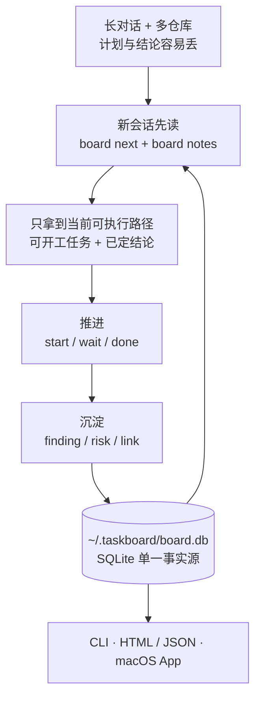

# claude-taskboard

面向个人与 AI 编程助手的跨对话需求/工作流看板。CLI 更新进度,本地服务实时查看,或导出
自包含 HTML 发到任何地方。它不是多人协作、权限管理或云同步系统。
纯标准库,无第三方依赖;数据存 `~/.taskboard/board.db`(SQLite)。

解决的问题:和 Claude Code、Codex 等助手长对话时,计划滚出上下文就看不见了;
一个需求跨多个仓库推进时,
「现在能开工的是哪几件、谁卡着谁」没有单一去处。

## 30 秒看懂



## 安装

### Homebrew（公开仓库发布后）

与 CCSwitch CLI 相同，Taskboard 使用第三方 tap 发布：

```bash
brew tap <github-owner>/tap
brew install taskboard
```

升级与卸载：

```bash
brew upgrade taskboard
brew uninstall taskboard
```

当前仓库尚未关联公开 GitHub remote，因此 `<github-owner>` 仍是发布时参数；本地 Formula、
MIT License、确定性源码归档和 tap 自动更新 workflow 已就绪。Formula 安装 `board` CLI 和
Agent Skill，不会创建或覆盖 `~/.taskboard/board.db`。

### 从源码安装

```bash
pip install -e /path/to/claude-taskboard
```

得到全局命令 `board`。数据库位置可用 `TASKBOARD_HOME` 覆盖。

## 让 AI Agent 自动使用

仓库内置标准 Agent Skill: `.agents/skills/taskboard`。先安装上面的 `board` CLI，
再在 claude-taskboard 仓库根目录执行对应命令。

### Codex / Cursor

Codex 和 Cursor 打开本仓库时会自动发现 `.agents/skills`。要让 skill 在所有项目可用：

```bash
TASKBOARD_ROOT="$(pwd)"
mkdir -p "$HOME/.agents/skills"
ln -sfn "$TASKBOARD_ROOT/.agents/skills/taskboard" "$HOME/.agents/skills/taskboard"
```

### Claude Code

```bash
TASKBOARD_ROOT="$(pwd)"
mkdir -p "$HOME/.claude/skills"
ln -sfn "$TASKBOARD_ROOT/.agents/skills/taskboard" "$HOME/.claude/skills/taskboard"
```

### Gemini CLI

Gemini CLI 使用 `GEMINI.md` 上下文文件，而不是 Agent Skills 目录。以下命令会幂等地
导入同一份 `SKILL.md`：

```bash
TASKBOARD_ROOT="$(pwd)"
mkdir -p "$HOME/.gemini"
ln -sfn "$TASKBOARD_ROOT/.agents/skills/taskboard/SKILL.md" "$HOME/.gemini/taskboard.md"
touch "$HOME/.gemini/GEMINI.md"
grep -Fqx '@./taskboard.md' "$HOME/.gemini/GEMINI.md" || \
  printf '\n@./taskboard.md\n' >> "$HOME/.gemini/GEMINI.md"
```

运行 Gemini CLI 后执行 `/memory refresh`。如果 Agent 没有立即发现新建的顶层 skill
目录，重启一次。无法使用符号链接的环境可以复制整个 `taskboard` skill 目录，更新时
重新复制。

安装位置依据 [Codex Skills](https://developers.openai.com/codex/skills)、
[Cursor Agent Skills](https://cursor.com/docs/skills)、
[Claude Code Skills](https://code.claude.com/docs/en/slash-commands) 和
[Gemini CLI GEMINI.md](https://google-gemini.github.io/gemini-cli/docs/cli/gemini-md.html)。

## 上手

```bash
# 先确认稳定目标和涉及仓库，再登记一级需求；--repo 可重复
board init website-refresh --name "网站改版" --summary "重做官网并完成上线" \
  --repo ../website_backend --repo ../website_frontend

# 加执行任务,明确本任务涉及需求仓库中的哪几个
board add "确认需求" --owner 你 --repo website_backend --repo website_frontend
board add "实现页面" --owner 我 --blocked-by 1 --repo website_frontend
board add "发布上线" --gate --blocked-by 2 --repo website_backend --repo website_frontend

# 推进
board start 1
board wait 1                                  # 卡在人工/外部动作上(服务器执行、等发版)
board done 1                                  # 提示解锁了谁、打印验收条件、记录完成时 HEAD

# 看
board brief               # 交接摘要:新会话读这一段就能接上
board next                # 现在能开工的(--owner 我 只看自己的)
board ls                  # 当前需求未完成任务(--done 含已完成,-A 所有需求)
board find <关键词>        # 搜任务与记录
board stale --days 3      # 停滞的在办任务
board projects            # 所有需求的进度概览(命令名为兼容保留)
board show 3              # 单个任务详情
board log                 # 变更历史
```

Agent 初始化需求或给多仓库需求新增正式任务时，应先列出关联仓库并让用户确认；当前请求已明确
仓库集合时可直接执行。CLI 在多仓库需求里省略 `board add --repo` 会拒绝创建，避免静默误挂。

`todo`(没开工)、`active`(我在做)、`waiting`(等人工)三态分开:`waiting` 不算
"可开工",因为它等的是人不是我;`board next` 会把它单列成"等人工"。

任务可以带验收条件与代码坐标:

```bash
board add "发布新版" --accept "核心流程冒烟通过" --branch codex/site-refresh --pr 96
```

`--accept` 在 `board done` 时打印出来对照,`board done` 还会把当时的 HEAD sha 记进
事件流(任务字段里存 sha 会被 squash/rebase 弄失效,事件流才是可靠出处)。

## 三类记录,不只是任务

长期项目里真正会被遗忘的不是待办,而是**已经查明的结论**——不写下来就会重复推演。

```bash
board finding "移动端首屏慢在大图" --category "性能" --metric "LCP 4.2s → 1.8s" --body "压缩图片后的对照结果..."
board risk "旧浏览器样式降级" --category "兼容性" --body "不阻塞上线,后续补兼容验证"
board link "docs/release-checklist.md" --category "发布" --body "发布验收清单"
board notes -v            # 一起看
board note-category 12 18 --category "性能"  # 给已有记录归类
```

- `finding` 约束性结论:已判定的事实,后续不要再推演
- `risk` 尾巴与已知风险:不阻塞主线但别丢
- `link` 关键文件/入口

结论和风险按 `category` 分组展示，分类会进入 CLI、实时页面、静态导出和 JSON。每个需求
建议维护 2~6 个稳定主题，用“模型口径”“事实补录”“发布协同”这类短名词；不要把分类
写成状态、日期或一次性标签。未填写的旧记录会安全落入“未分类”，可用
`board note-category` 逐步回填，不需要迁移或重建数据库。

### Markdown 内容

任务 `detail`、finding/risk 的 `body` 支持安全 Markdown:段落、标题、无序/有序列表、
引用、粗体/斜体、行内代码、围栏代码块和 HTTP/HTTPS/mailto/相对链接。验收条件与
关键文件说明支持行内格式。标题和 `metric` 保持纯文本结构化字段。

原始 HTML 会被转义，`javascript:`/`data:` 等危险链接不会生成可点击链接。图片、表格、
复杂嵌套列表暂不支持；完整材料应保存在文件中，再用 `board link` 记录入口。

多行 CLI 参数必须传真实换行。bash/zsh 可使用
`--body $'第一段\n\n- 第二段'`；不要把 `\n\n` 写在普通双引号中，否则 shell 会将它按
字面量传入，正文中的反引号还可能触发命令替换。多行 Markdown 参数统一使用 ANSI-C
单引号；确需展示转义符时，用行内代码包裹 `` `\n\n` ``。

## 查看

```bash
board serve --open        # localhost:8787,CLI 一改 2 秒内自动刷新；本机可轻量操作
board export -p website-refresh --out board.html
board export --json --out board.json   # 给其他工具消费,默认同样隐藏本机路径
board export --show-paths --out local.html  # 仅本地查看时保留数据库和仓库路径
board set --artifact-url https://...   # 记住发布链接,export 时提醒复用
```

`board serve` 的本机页面不再只是静态展示：可按关键词、状态和负责人筛选，打开任务详情
查看正文、验收、依赖、分支/PR 与事件历史，也可执行开始/等人工/完成/退回，或轻量新增
任务和 finding。标记完成前会再次展示验收条件；完成事件记录的是该项目登记仓库的 HEAD，
不是看板服务自身目录的 HEAD。复杂的依赖、闸门、supersede 和长篇编辑仍建议使用 CLI 或
让 AI Agent 操作，避免把看板变成重型编辑器。

搜索与筛选也会进入静态 HTML，但详情接口和全部写入控件只存在于 `board serve` 页面；
`board export` 始终只读。

导出的 HTML 自包含、无外部请求,可直接作为 Artifact 发布或丢进任何静态托管。
默认隐藏数据库与仓库的本机绝对路径;明暗主题跟随系统,已完成的任务折进一个可展开区块,
页面只显示剩余路径。

发布前仍应检查内容:任务正文、结论、风险、分支名和链接会原样进入导出文件。
用 `-p <key>` 只导出准备公开的项目。`board serve` 没有用户身份认证；写入只在
`127.0.0.1`、`localhost` 或 `::1` 监听时启用，并校验 Host、Origin、进程级 CSRF、
JSON 类型和请求体大小。绑定其他地址时页面自动只读，但仍不要把它直接暴露到公网或
不可信局域网。

### macOS 菜单栏 App

原生 AppKit/WebKit 菜单栏 App 复用同一个 SQLite 数据库和 `board export` 渲染逻辑,
不需要常驻 HTTP 服务。窗口打开时监听 `board.db`、WAL 和 SHM 文件,CLI 修改后自动刷新;
关闭终端不会影响 App。

```bash
./macos/TaskboardMenuBar/build_app.sh
mkdir -p ~/Applications
ditto dist/Taskboard.app ~/Applications/Taskboard.app
open ~/Applications/Taskboard.app
```

菜单提供打开/重新加载看板、在 Finder 中显示数据库和“登录时启动”。登录启动使用
macOS 13+ 的 `SMAppService`;首次启用后若系统要求批准,到“系统设置 → 通用 → 登录项”
确认即可。

「打开任务看板」优先唤起 Tauri 桌面版 `Taskboard Desktop.app`（运行中则激活,已安装则
启动),找不到时回退壳内原生窗口;桌面版可用时壳启动只驻留菜单栏,不再自动弹窗。定位
顺序与打包方式见 `apps/desktop/README.md`。

构建脚本会把当前 `board` 的绝对路径写进 App。换了 Python 环境后重新构建,或启动 App
前设置 `TASKBOARD_BOARD_EXECUTABLE`。数据库默认仍为 `~/.taskboard/board.db`;
也支持 `TASKBOARD_HOME` 或 App 专用的 `TASKBOARD_DB` 绝对路径。

图标母版位于 `macos/TaskboardMenuBar/Resources/AppIcon.png`。构建时
`Scripts/make_icns.sh` 会生成 16px 到 1024px 的标准 `AppIcon.icns` 并装入 App。

### Tauri + Vue 只读 POC

`apps/desktop` 验证用 Tauri v2 + Vue 3 + TypeScript + Pinia 替换桌面展示层。POC 通过受限
Rust command 调用 `board export --json`，保留现有 Python CLI、SQLite 数据模型和 Swift
实现；当前已迁移成熟看板的全局统计、搜索、状态/负责人筛选、需求导航、任务路径与结论区，
需求置顶和拖动排序与 Swift 版共享 `*.view.json`，结论按主题使用多 Sheet 切换；点击状态
胶囊可切换 待办/进行中/等人工/完成（与 `board serve` 网页同一白名单，映射到 CLI 子命令
执行，完成需确认验收条件）。负责人分配与 Agent 派发是两个独立动作：Codex 经官方
app-server 创建并提交线程，Claude 经官方深链预填桌面 Code 会话；看板保存派发标识和公开
线程/运行 ID，不读取 Agent 私有数据库。其余写入仍走 CLI。

```bash
cd apps/desktop
npm install
npm run tauri dev
```

开发约束、数据入口和验证命令见 [`apps/desktop/README.md`](apps/desktop/README.md)。

## 寻址规则

任务在需求内用 `#ref` 寻址(需求内自增)。`projects`、`--project` 等内部/CLI 名称为兼容保留。
当前需求的判定优先级:

1. `-p <key>` 显式指定
2. cwd 落在需求关联仓库路径下,且只匹配一个需求
3. `board use <key>` 固定的需求
4. 只有一个需求时就是它

同一仓库可服务多个需求；出现多个匹配时会报错要求 `-p` 指定,不会猜。

仓库在磁盘上改名或搬家后,用 `board repo-move <原名或原路径> <新路径>` 迁移登记路径,已有
需求与任务关联跟着走(关联表存的是仓库 id,不需要逐个改任务)。`board set --repo` 做不到:
它按路径集合做增删,旧路径不在新集合里就当成解除关联,会被"仓库仍被任务使用"挡下。

```bash
board repo-move claude-taskboard ~/Documents/GitHub/taskboard
```

新路径不存在时会拒绝执行(防拼错),确认无误可加 `--force`；新路径已经登记成另一个仓库时,
加 `--merge` 把旧仓库的关联并过去并删掉旧登记。

## 开发

```bash
python3 -m pytest tests -q
swift run --package-path macos/TaskboardMenuBar TaskboardCoreSelfTest
cd apps/desktop && npm run test && npm run build
cargo test --manifest-path apps/desktop/src-tauri/Cargo.toml
```

数据模型:`projects`(产品语义为需求/工作流) / `repositories` /
`project_repositories` / `tasks`(需求内 ref 唯一) / `task_repositories` /
`task_commits`(任务逐仓库的提交区间)/ `deps`(建边时拒绝成环)/
`notes`(finding·risk·link,支持 supersede)/ `events`(只追加的变更流)。
渲染与 `board next` 共用 `Store.snapshot()`,阻塞判定与"可开工"只有这一处实现。

提交区间:`start` 记每个关联仓库的 HEAD 作为起点,`done` 记终点,起点只记第一次,
所以任务退回重做后区间仍覆盖全部改动。取 SHA 集中在 `taskboard/gitref.py`,按任务
关联仓库逐个取,不看执行命令时的 cwd。两端齐全才算完整区间;`board show` 会顺带探测
sha 是否还在仓库里,rebase/squash 之后明说失效而不是给出错误的 diff 范围。

并发:WAL + `busy_timeout`,`ref` 分配在 `BEGIN IMMEDIATE` 写锁下完成,配合
`UNIQUE(project, ref)` 双保险,多个 CLI 进程同时写不会重号。
升级:新版本打开老库会把旧 `projects.repo` 自动回填到需求与既有任务的仓库关联表,
不需要单独的迁移命令。
仓库路径变化用 `board repo-move` 就地改 `repositories.path`,`project_repositories` 与
`task_repositories` 按 id 引用,自动跟随。

### 发布 Homebrew Formula

首次发布前准备两个公开仓库：`<owner>/claude-taskboard` 与 `<owner>/homebrew-tap`，后者包含
`Formula/` 目录。在源码仓库设置 `HOMEBREW_TAP_TOKEN`，令其只对 `homebrew-tap` 有
`contents:write` 权限。

版本以 `pyproject.toml` 为准。推送同版本 tag 后，
[release workflow](.github/workflows/release.yml) 会：

1. 运行 Python 测试。
2. 生成确定性的 `claude-taskboard-<version>.tar.gz` 与真实 SHA-256。
3. 创建 GitHub Release。
4. 更新 `<owner>/homebrew-tap` 的 `Formula/taskboard.rb`。

本地可先生成发布物：

```bash
python3 scripts/prepare_homebrew_release.py \
  --repository <owner>/claude-taskboard \
  --output-dir dist/homebrew
```

Formula 的发布模板位于 `packaging/homebrew/taskboard.rb.in`，依赖 Homebrew
`python@3.13`，不会使用用户全局 Python 环境。菜单栏 App 尚未进入 cask：正式 cask
发布需要 Developer ID 签名与 notarization，不能使用当前 ad-hoc 签名产物。
